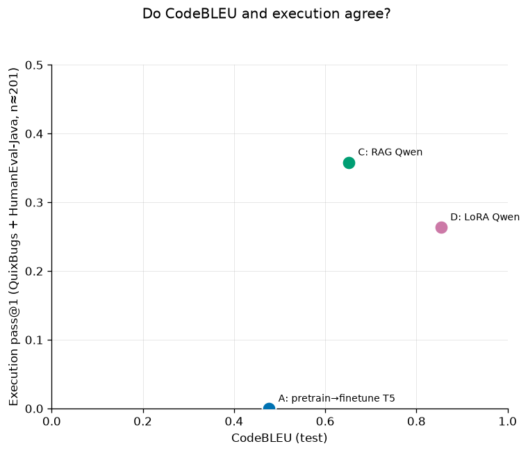

# pretrain-or-prompt

**Does pretraining a small T5 on code beat prompting — or cheaply adapting — a much larger code
LLM, for Java bug-fixing?** A four-arm study: pretrain→finetune T5-small, from-scratch T5-small,
RAG-prompted Qwen2.5-Coder-1.5B, and LoRA-finetuned Qwen2.5-Coder-1.5B, compared on both surface
similarity (CodeBLEU) and whether the fix actually compiles and runs.

## TL;DR — the findings

- **Execution inverts the CodeBLEU ranking.** LoRA (arm D) wins CodeBLEU (0.854), but RAG (arm C)
  fixes the most real bugs (**35.8%** vs **26.4%** pass@1) — while both T5 arms (A and B), despite
  competitive CodeBLEU, fix **zero** of 201 real bugs (identical 0% compile/pass — the shared
  whole-file-vs-method mismatch). Surface similarity and functional correctness disagree at the top of
  the ranking.
- **Pretraining buys no CodeBLEU benefit at full data.** Arm A (pretrained) and arm B
  (from-scratch) converge to ≈0.48 CodeBLEU by the full 52K-pair split. Pretraining's head start
  is real at small data budgets (a ~0.08-point gap at 1K pairs) but shrinks steadily and is gone
  by 52K.
- **RAG clearly beats zero-shot — retrieval, done right, helps.** Adding a single retrieved
  exemplar lifts CodeBLEU from 0.37 to 0.65, and the Qwen arms produce real, non-trivial exact
  matches (LoRA: 9.5% EM) where the T5 arms sit at ~0. That gain depends on the prompt being built
  correctly — full exemplars, chat-templated; a naive few-shot prompt (truncated exemplars, no chat
  template) actively *hurts* vs. zero-shot.
- **The measurement stack is built for rigor.** Whitespace-normalized + strict exact match,
  CodeBLEU, tree-sitter syntax-validity, bootstrap CIs, and a JDK execution harness validated
  **201/201** on reference patches — see [the measurement notes](docs/measurement.md) for the
  evaluation pitfalls this stack is designed to avoid.

## Results at a glance

| Arm | Adaptation | CodeBLEU | Syntax-valid | EM | Exec pass@1 (201 bugs) |
|-----|------------|----------|--------------|-----|-------------------------|
| A | pretrain→finetune T5-small | 0.477 | 92% | ~0 | 0.0% |
| B | from-scratch T5-small | 0.479 | 88% | ~0 | — (not run) |
| C | RAG Qwen (CodeBERT retriever, k=1) | 0.652 | 96% | 1.9% | **35.8%** |
| D | LoRA Qwen | **0.854** | 94% | **9.5%** | 26.4% |

*Arm D tops the CodeBLEU column; arm C tops the execution column — that inversion is the
headline finding (see [the report](docs/report.md) §"Execution vs CodeBLEU").*

## Headline figures




## Read the full study

- **[docs/report.md](docs/report.md)** — method, all four arms' results tables, scaling curves,
  seven cross-arm findings, and limitations.
- **[docs/measurement.md](docs/measurement.md)** — the evaluation pitfalls that make code
  bug-fixing metrics easy to get wrong (strict-equality EM reporting 0%, few-shot prompts that hurt
  instead of help), and the guards in the eval stack that avoid each. Read this for the rigor case
  behind the numbers above.

## Repo map

- **`src/pop/`** — the package: data loading, tokenizer, T5 model, training (`train/`: pretrain,
  finetune, LoRA), evaluation (`eval/`: EM/CodeBLEU/syntax-validity/bootstrap CIs), `rag/`
  (retrieval-augmented prompting), `execbench/` (JDK execution harness).
- **`scripts/`** — orchestrators (`run_training.py`, `run_rag.py`, `run_scaling.py`), figure
  scripts (`figures/make_all.py`), and CSV aggregators (`build_scaling_csv.py`,
  `build_execbench_agreement_csv.py`).
- **`configs/`** — YAML configs for every run (pretrain, finetune sweeps, RAG retriever×k sweep,
  LoRA, scaling).
- **`notebooks/`** — Colab "Run-all" kits used to produce every GPU result in this study.
- **`benchmarks/`** — vendored QuixBugs-Java + HumanEval-Java + the JDK execution harness.
- **`results/`** — the committed `*.json` metrics every number in the report traces back to.
- **`docs/`** — the study report, measurement notes, and reproduction runbooks.
- **`tests/`** — the test suite; run it with `uv run pytest` (or `uv run pytest -m "not jdk"` to
  skip the tests that need a local JDK, which is what CI does).

## What you need

| | |
|---|---|
| **Python 3.11 or 3.12** | **3.13 and newer cannot install this project.** `codebleu` 0.7.0 requires `tree-sitter` 0.22.x, which publishes wheels for cp39–cp312 only. Step 3 below installs a private CPython 3.12 for you, so you do not need one on `PATH`. |
| **~3 GB of free disk** | for the virtual environment; `torch` is most of it. |
| **Nothing else** | No GPU, no account, no API key, no environment variable. Past the package downloads in step 3, the walkthrough below makes no network requests at all. |

A **JDK 17 or newer** on `PATH` is needed for one thing only: the Java execution harness
(`pop execbench`, and the tests marked `jdk`). The CPU walkthrough below never calls it. CI uses
Temurin 17; development here is on Temurin 21.

**Platforms.** Windows 11 (developed and tested here) and Linux (GitHub Actions `ubuntu-latest`, on
every push). **macOS is untested** — nothing in the code is platform-specific and it ought to work,
but no one has run it, so it is not a support claim.

## Reproduce it — CPU only, about five minutes

Nothing here retrains anything. Every number in the report was produced on a GPU and is committed
under `results/`; these steps rebuild the study's outputs from those committed measurements.

**Step 1 — clone the repo.**

```bash
git clone https://github.com/yib7/Strats-for-Bug-Fixing.git
cd Strats-for-Bug-Fixing
```

**Step 2 — install `uv`** *(skip if `uv --version` already prints a version)*. It is the only tool
you install by hand, and it is how CI builds this project too.

```bash
curl -LsSf https://astral.sh/uv/install.sh | sh              # Linux / macOS
powershell -c "irm https://astral.sh/uv/install.ps1 | iex"   # Windows
```

**Step 3 — build the environment.**

```bash
uv sync --frozen
```

`uv` reads `.python-version` and `uv.lock`, downloads CPython 3.12 if your machine has no
compatible interpreter, creates `.venv`, and installs the exact dependency versions CI tests
against plus `pop` itself. There is no activation step — the `uv run` commands below find this
environment on every platform.

**Step 4 — run the whole pipeline end to end.**

```bash
uv run pop smoke
```

Tokenizer training → pretraining → finetuning → generation → scoring, on tiny committed fixtures,
in about ten seconds on a CPU. It prints a summary table and writes `results/smoke_local.json`,
which is gitignored: an ad-hoc run can never overwrite a published measurement.

**Step 5 — rebuild the figures and the docs site** *(optional — skip it if you only wanted to
confirm the install works)*.

```bash
uv run python scripts/figures/make_all.py   # re-render docs/figures/*.png from results/*.json
uv run python -m mkdocs build               # build the study site into ./site
```

### Anything else worth running

```bash
uv run pytest                                # the test suite (add -m "not jdk" if you have no JDK)
uv run pop --help                            # all ten subcommands
uv run pop execbench --validate-references   # needs a JDK: compiles and runs all 201 bugs
```

Failures print one line, not a traceback: exit **2** means bad or missing input, exit **1** means
the run happened and failed. Set `POP_TRACEBACK=1` to get the full traceback back.

For the full GPU reproduction (pretrain → finetune → RAG → LoRA → execution eval), see
[docs/gpu-runbook.md](docs/gpu-runbook.md).
