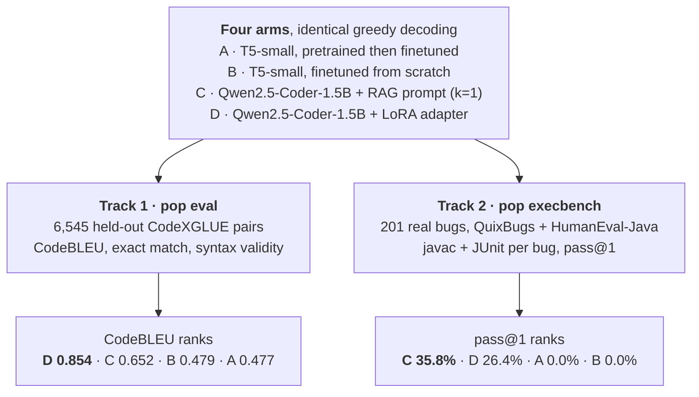

# pretrain-or-prompt

**Does pretraining a small T5 on code beat prompting, or cheaply adapting, a much larger code LLM
at fixing Java bugs?** Four arms, scored twice: once on surface similarity, once on whether the fix
actually compiles and passes the bug's tests. The two scores disagree, and that turned out to be
the finding.

[](https://github.com/yib7/Strats-for-Bug-Fixing/actions/workflows/ci.yml)
[](https://yib7.github.io/Strats-for-Bug-Fixing/)
[](pyproject.toml)
[](LICENSE)

**Read the study online: <https://yib7.github.io/Strats-for-Bug-Fixing/>**


Every command in that recording runs on a laptop CPU from a clean clone, with no GPU and no API
key. The output was captured from a live run: `scripts/media/readme_walkthrough.txt` is the
storyboard, and it states exactly which lines were trimmed.

## What the numbers mean

Two scores do all the work here, and they measure different things.

**CodeBLEU** asks how closely the fix *resembles* the known-good fix. It compares tokens, syntax
tree and data flow, and returns a number from 0 to 1. It never runs the code, so a fix that reads
plausibly but does not compile can still score well.

**Execution pass@1** asks whether the fix *works*. Compile the model's first and only attempt with
`javac`, run that bug's JUnit tests, and count it only if the tests pass. One attempt, no retries.

The rest of the vocabulary, defined once:

- An **arm** is one complete recipe for turning a buggy Java method into a fixed one. This study
  compares four of them.
- **RAG** (retrieval-augmented generation) means searching the training set for an already-fixed bug
  that resembles this one and pasting it into the prompt as a worked example before asking for a fix.
- **LoRA** is cheap finetuning: rather than updating all 1.5B weights, train a small adapter
  alongside the frozen model. It fits on one consumer GPU.
- **EM** (exact match) is the strictest score. The fix has to equal the reference character for
  character once whitespace is normalized.

## What the study found

- Execution inverts the CodeBLEU ranking. LoRA (arm D) wins CodeBLEU at **0.854**, but RAG (arm C)
  fixes more real bugs: **35.8%** pass@1 against D's 26.4%, over 201 Java bugs.
- Both T5 arms fix **zero** of those 201 bugs, at a 0.0% compile rate, despite CodeBLEU near 0.48.
  Their predictions are well-formed methods; the benchmark feeds whole files. CodeBLEU parity does
  not mean functional parity.
- Pretraining buys no CodeBLEU benefit at full data. Arms A and B converge to ≈0.48 by the full
  52K-pair split. The head start is real when data is scarce (≈0.08 CodeBLEU at 1K pairs) and gone
  by 52K.
- Retrieval helps, but only if the prompt is built correctly. One retrieved exemplar lifts CodeBLEU
  from 0.37 to 0.65. Truncate the exemplars and skip the chat template and RAG scores *below*
  zero-shot, which reads as "retrieval hurts" when the real cause is prompt construction.
- The execution harness was validated 201/201 on the benchmarks' own reference patches before any
  model was scored, so a 0% arm is a claim about the model, not about the harness.

## The four arms and two tracks



Same four arms, same decoding, two scores, and the ranking flips at the top. Arms C and D run on the
same base model, `Qwen2.5-Coder-1.5B-Instruct`, so C against D is a clean prompting-vs-adapting
comparison rather than a comparison of two different models.
[docs/architecture.md](docs/architecture.md) traces the data flow behind this in detail.

## Results

| Arm | Adaptation | CodeBLEU | Syntax-valid | EM | Exec pass@1 (201 bugs) |
|-----|------------|----------|--------------|-----|------------------------|
| A | pretrain → finetune T5-small | 0.477 | 0.917 | 0.05% | 0.0% |
| B | from-scratch T5-small (seed mean) | 0.479 | 0.885 | 0.05% | 0.0% |
| C | RAG Qwen (CodeBERT retriever, k=1) | 0.652 | 0.960 | 1.89% | **35.8%** |
| D | LoRA Qwen | **0.854** | 0.937 | **9.47%** | 26.4% |

EM is whitespace-normalized exact match over the 6,545-pair test split; the T5 arms land 2 to 4
matches out of 6,545, which is a property of those models rather than a broken metric. Every cell
traces to a file in [`results/`](results/), and the per-benchmark splits are in
`results/execbench_*.json`.


## Read the full study

The site is published at **<https://yib7.github.io/Strats-for-Bug-Fixing/>**. To read it offline
instead, `uv run python -m mkdocs build` renders the same thing into `./site`:


- [docs/report.md](docs/report.md) is the study itself: method, per-arm tables, scaling curves,
  seven cross-arm findings, limitations.
- [docs/architecture.md](docs/architecture.md) maps the code: what the four arms are, what the two
  tracks measure, and how a prediction becomes a committed number.
- [docs/measurement.md](docs/measurement.md) covers the two evaluation pitfalls that can invert a
  bug-fixing result, and the guard against each. Read this for the rigor case behind the numbers.

## Tech stack

| Layer | What is used |
|---|---|
| Models | T5-small built here from a manual `T5Config`, never a downloaded checkpoint; Qwen2.5-Coder-1.5B-Instruct as the larger base |
| Training | PyTorch, `transformers`, `accelerate`, PEFT LoRA, and a SentencePiece tokenizer trained in-repo |
| Retrieval | `bm25s` for BM25, CodeBERT embeddings + FAISS for dense, behind one `index()`/`retrieve()` interface |
| Evaluation | `codebleu`, a tree-sitter Java parse for syntax validity, percentile bootstrap CIs on numpy |
| Execution | JDK 17+, `javac` and JUnit 4.13.2 per bug in a subprocess, under a timeout and a 2 GB heap cap |
| Interface | one `pop` CLI with ten subcommands, pydantic v2 models validating every YAML run config |
| Tooling | uv with a committed lockfile, ruff, pytest, pre-commit, GitHub Actions, MkDocs |
| Data | CodeXGLUE code refinement (medium, Java), CodeSearchNet-Java, QuixBugs-Java, HumanEval-Java |

## What you need

| Requirement | Detail |
|---|---|
| **`git` and `uv`** | The only two tools you install yourself. Step 2 has the `uv` one-liner; `uv` then supplies the interpreter and every package. |
| **Python 3.11 or 3.12** | **3.13 and newer cannot install this project.** `codebleu` 0.7.0 requires `tree-sitter` 0.22.x, which publishes wheels for cp39–cp312 only. Step 3 fetches a private CPython 3.12 for you, so you do not need one on `PATH`. |
| **~2.2 GB of free disk** | A 1.1 GB virtual environment plus 1.1 GB in `uv`'s shared download cache. `torch` is most of both. |
| **Nothing else** | No GPU, no account, no API key, no environment variable, no compiler. Past the package downloads in step 3, the walkthrough below makes no network requests at all. |

A **JDK 17 or newer** on `PATH` is needed for one thing only: the Java execution harness
(`pop execbench`, and the tests marked `jdk`). The CPU walkthrough below never calls it. CI uses
Temurin 17; development here is on Temurin 21.

**Platforms.** Windows 11 (developed and tested here) and Linux (GitHub Actions `ubuntu-latest`, on
every push). **macOS is untested.** Nothing in the code is platform-specific and it ought to work,
but no one has run it, so it is not a support claim.

## Reproduce it on CPU, a couple of minutes

Nothing here retrains anything. Every number in the report was produced on a GPU and is committed
under `results/`; these steps rebuild the study's outputs from those committed measurements. Clone
to first result took **96 seconds** on a fresh Windows 11 machine with an empty package cache.
Budget more if your connection is slower, since step 3 downloads about 1.1 GB.

**Step 1: clone the repo.**

```bash
git clone https://github.com/yib7/Strats-for-Bug-Fixing.git
cd Strats-for-Bug-Fixing
```

**Step 2: install `uv`** *(skip if `uv --version` already prints a version)*. It is the only tool
you install by hand, and it is how CI builds this project too.

```bash
curl -LsSf https://astral.sh/uv/install.sh | sh              # Linux / macOS
powershell -c "irm https://astral.sh/uv/install.ps1 | iex"   # Windows
```

**Step 3: build the environment.**

```bash
uv sync --frozen
```

`uv` reads `.python-version` and `uv.lock`, downloads CPython 3.12 if your machine has no
compatible interpreter, creates `.venv`, and installs the exact dependency versions CI tests
against plus `pop` itself. There is no activation step: the `uv run` commands below find this
environment on every platform.

**Step 4: run the whole pipeline end to end.**

```bash
uv run pop smoke
```

Tokenizer training → pretraining → finetuning → generation → scoring, on tiny committed fixtures.
It prints a summary table and writes `results/smoke_local.json`, which is gitignored, so an ad-hoc
run can never overwrite a published measurement. Expect about a minute the first time (Python is
byte-compiling the packages it just installed) and about 9 seconds on every run after that.

**Step 5: rebuild the figures and the docs site** *(optional; skip it if you only wanted to
confirm the install works)*.

```bash
uv run python scripts/figures/make_all.py   # re-render docs/figures/*.png from results/*.json
uv run python -m mkdocs build               # build the study site into ./site
```

The committed PNGs were rendered on Windows. matplotlib rasterises text through whichever freetype
its wheel was built against, so re-rendering on Linux or macOS reproduces the same plot from the
same numbers but writes different bytes, and `git status` will show the three figures as modified.
That is expected; `git checkout docs/figures` puts the committed copies back.

### Anything else worth running

```bash
uv run pytest                    # the test suite, 386 tests, ~55 s (add -m "not jdk" if you have no JDK)
uv run pop --help                # all ten subcommands
uv run pop execbench --validate-references --jobs 4   # needs a JDK; 201/201 in ~40 s
```

A missing or malformed input, such as no config file, broken YAML, a prediction record without a
`reference` key, or no JDK on `PATH`, prints one actionable line and exits **2**, never a
traceback. Set `POP_TRACEBACK=1` if you want the traceback back.

For the full GPU reproduction (pretrain → finetune → RAG → LoRA → execution eval), see
[docs/gpu-runbook.md](docs/gpu-runbook.md).

## Repo map

- [`src/pop/`](src/pop/) is the package: data loading, tokenizer, T5 model, training (`train/`:
  pretrain, finetune, LoRA), evaluation (`eval/`: EM, CodeBLEU, syntax validity, bootstrap CIs),
  `rag/` for retrieval-augmented prompting, and `execbench/` for the JDK harness.
- [`scripts/`](scripts/) holds the orchestrators (`run_training.py`, `run_rag.py`,
  `run_scaling.py`), the figure scripts (`figures/make_all.py`), the CSV builders, and the two
  generators for the README's GIF and screenshot under `media/`.
- [`configs/`](configs/) is 31 YAML files, one per run: pretrain, finetune sweeps, the RAG
  retriever×k sweep, LoRA, and the scaling grid.
- [`notebooks/`](notebooks/) is five Colab kits, one per GPU stage, that produced every result in
  `results/`.
- [`benchmarks/`](benchmarks/) is vendored third party: QuixBugs-Java, HumanEval-Java, and the
  JUnit and Hamcrest jars the harness compiles against.
- [`results/`](results/) is the committed measurements every number in the report traces back to,
  plus two derived CSVs.
- [`docs/`](docs/) is the study report, the architecture page, the measurement notes, the GPU
  runbooks, and the rendered figures.
- [`tests/`](tests/) is the suite. Run it with `uv run pytest`, or `uv run pytest -m "not jdk"` to
  skip the tests that need a local JDK, which is what CI does.

## What this does not show

- One decoding setting. Greedy, 256 new tokens, every arm. No beam-search pass was run.
- CodeBLEU is a surface proxy. An edit that is valid but different, or that does not compile at
  all, can still score well on it. That is why Track 2 exists.
- The T5 arms' 0% execution pass is an input-distribution mismatch, not proof they learned nothing.
  Track 1 shows both arms learning the refinement task; the execution benchmark then hands them
  whole concrete Java files they were never trained on.
- The larger base is Qwen2.5-Coder-1.5B-Instruct. Qwen3-Coder exists, but its smallest published
  size is 30B-A3B, so the 1.5B tier has no Qwen3-Coder equivalent to swap in and rerun.
- Every `results/*.json` carries `git_sha: unknown`, because the Colab runs executed from an
  uploaded zip with no `.git`. The committed JSONs are the source of truth, and every number in the
  report was cross-checked against its own file.

## License

MIT, see [LICENSE](LICENSE). The benchmark programs and jars under `benchmarks/` are third party and
keep their own licenses; [CREDITS.md](CREDITS.md) lists each one with its attribution terms. Release
notes are in [CHANGELOG.md](CHANGELOG.md), and [SECURITY.md](SECURITY.md) covers reporting and what
the execution harness does and does not sandbox.
