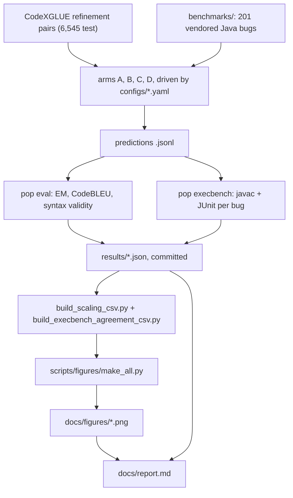

# Architecture

One question drives this repo: for Java bug fixing, does pretraining a small model beat prompting
or cheaply adapting a larger one? Four systems answer it, each scored two different ways. This page
is the map. It covers what the four systems are, how a prediction becomes a committed number, and
which parts you can run on a laptop.

## Four arms

An "arm" is one way of turning a buggy Java method into a fixed one.

| Arm | Model | How it is adapted |
|-----|-------|-------------------|
| **A** | T5-small (vocab 16,384), trained here from nothing | span-corruption pretraining, then finetuning |
| **B** | the same T5-small | finetuning only, from a random init |
| **C** | Qwen2.5-Coder-1.5B-Instruct | prompted with retrieved exemplars (RAG) |
| **D** | Qwen2.5-Coder-1.5B-Instruct | a LoRA adapter trained on the same pairs |

A against B is the pretraining question. C and D are what a much larger off-the-shelf code model
does with the same task, prompted or adapted. All four decode identically (greedy, 256 max new
tokens) so the comparison is fair.

## Two evaluation tracks

Each arm is scored twice, because the two scores do not agree.

**Track 1 measures surface similarity.** Every arm generates a fix for all 6,545 pairs in the
CodeXGLUE `code_x_glue_cc_code_refinement` (medium, Java) test split. `pop eval` scores exact match
(whitespace-normalized and raw), CodeBLEU, and tree-sitter syntax validity, with percentile
bootstrap confidence intervals.

**Track 2 measures whether the fix runs.** Every arm generates a fix for 201 real Java bugs
vendored under `benchmarks/`: 40 from QuixBugs-Java and 161 from HumanEval-Java. `pop execbench`
writes each candidate into a scratch copy of the benchmark's sources, compiles it with `javac`, and
runs that bug's JUnit tests in a subprocess under a timeout and a 2 GB heap cap. pass@1 is the
fraction whose tests pass. The harness is validated by running the benchmarks' own reference
patches through it, which score 201/201.

Track 1 ranks the arms D > C > A ≈ B. Track 2 ranks them C > D > A ≈ B, with both T5 arms fixing
zero bugs. `docs/report.md` has the numbers and what they mean.

## How a prediction becomes a committed number



Every result JSON carries the same envelope, written by `pop.eval.metrics.write_results`:
`{config, metrics, n, timestamp, git_sha}`.

## Nothing here retrains on clone

The GPU work happened once, on Colab, and its output is committed. `results/` holds 36 study
artifacts: 33 per-run metric JSONs, the harness validation run, and two derived CSVs.
`docs/results-manifest.md` names every one and what it is for.

That is why the local path is cheap. `scripts/figures/make_all.py` rebuilds the two CSVs from the
committed JSONs and re-renders all three figures in about a second, so the figures always reproduce
from a clean checkout rather than from a stale cached CSV. Changing a number would mean re-running
a GPU batch, not editing a file.

The reproduction path is documented in three places: `docs/gpu-runbook.md` (run the whole study in
one Colab sitting), `docs/colab-runbook.md` (the resumable T5 orchestrator and its Drive setup), and
`docs/gpu-reproduction.md` (environments, launch order per arm, and the local AMD/ROCm path).

Each notebook in `notebooks/` is one GPU stage of that batch:

| Notebook | Stage |
|----------|-------|
| `colab_phase2.ipynb` | arms A and B: tokenizer, 10-epoch pretrain, then six finetune/generate/eval cycles. "Phase 2" is this repo's label for that batch, and `results/phase2_summary.md` is its write-up |
| `colab_scaling.ipynb` | a fresh pretrain, then both scaling curves (14 configs) |
| `colab_rag.ipynb` | arm C: the eight-config retriever by k sweep |
| `colab_lora.ipynb` | arm D: LoRA train, generate, score |
| `colab_execbench.ipynb` | Track 2 for every arm, including the JDK install |

## Code map

`src/pop/` is the package. Everything else supports it.

| Path | What lives there |
|------|------------------|
| `src/pop/cli.py` | the `pop` command: ten subcommands, each a thin adapter over the modules below |
| `src/pop/config.py` | pydantic models every YAML config is validated against |
| `src/pop/data/` | loading the CodeSearchNet-Java pretraining corpus and the CodeXGLUE refinement pairs |
| `src/pop/tokenizer/` | SentencePiece training and an HF-compatible wrapper (arms A and B only) |
| `src/pop/models/` | the T5 factory: a manual `T5Config`, never a downloaded checkpoint |
| `src/pop/train/` | the training entry points (pretrain, finetune, LoRA), the `pop smoke` dry run, and GPU precision handling |
| `src/pop/rag/` | BM25 and CodeBERT retrievers, prompt building, and batched generation (vLLM when usable) |
| `src/pop/eval/` | normalization, the Track 1 metrics, and bootstrap confidence intervals |
| `src/pop/execbench/` | the Track 2 harness: JDK discovery, compile-and-test, outcome classification, pass@k |

The rest of the repo, top level:

| Directory | Role |
|-----------|------|
| `scripts/` | orchestrators (`run_training.py`, `run_rag.py`, `run_scaling.py`), config and manifest generators, the CSV builders, and `figures/` |
| `configs/` | 31 YAML files, one per run; the scaling configs are generated by `scripts/gen_scaling_configs.py` |
| `notebooks/` | five Colab kits, one per GPU stage, that produced every result in `results/` |
| `benchmarks/` | vendored third party: QuixBugs-Java, HumanEval-Java, JUnit and Hamcrest jars, with a `PROVENANCE.md` per directory. Upstream's layout, left as upstream ships it |
| `results/` | the committed measurements. Every number in the report traces to a file here |
| `docs/` | this page, the report, the measurement notes, the runbooks, and the rendered figures |
| `tests/` | the suite, plus the fixtures `pop smoke` runs on; tests needing a local JDK carry the `jdk` marker so CI can skip them |

## What runs without a GPU

```bash
uv run pop smoke                           # the whole pipeline shape on tiny fixtures, ~9 s
uv run python scripts/figures/make_all.py  # rebuild the CSVs and re-render the figures, ~1 s
uv run python -m mkdocs build              # build the docs site into ./site
uv run pytest                              # the suite; `-m "not jdk"` drops the harness tests
```

`pop smoke` runs tokenizer training, pretraining, finetuning, generation and scoring end to end on
committed fixtures in `tests/fixtures/`. It touches no network and proves the code path before
anything is spent on GPU time.

Track 2 additionally needs a JDK 17 or newer on `PATH`. `pop execbench --validate-references` is the
one-command check that a local JDK is wired up correctly.

## Two conventions worth knowing

Results names are protected. `write_results` refuses to overwrite an existing `results/<name>.json`,
and `pop smoke` and `pop execbench` default to names containing `_local`, which `.gitignore`
excludes. An ad-hoc run cannot land on top of a published measurement, and its output cannot be
committed by accident.

Every run is a YAML file. Each config in `configs/` is validated against a pydantic model in
`pop.config` before any work starts, so a typo surfaces as a one-line message instead of a crash an
hour into a training job. `pop finetune --config configs/finetune_A_ep10.yaml` is the whole
interface for a run.
