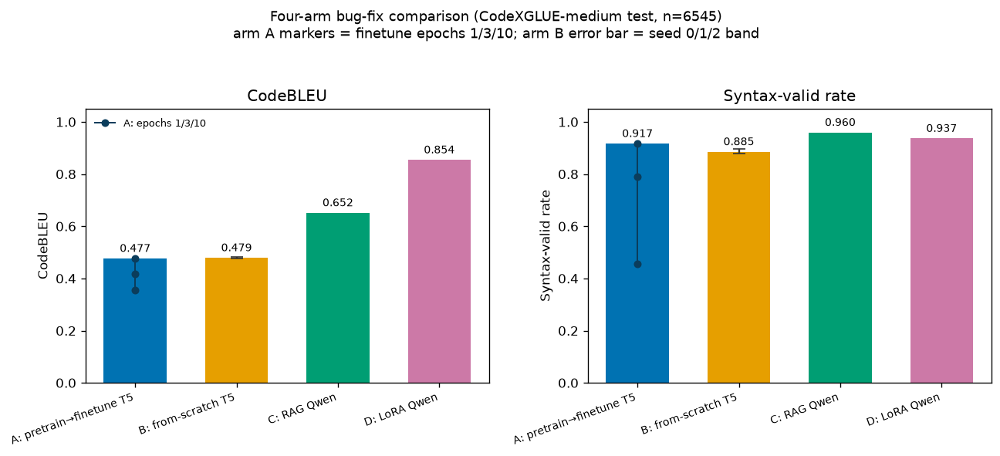

# pretrain-or-prompt

**Does pretraining a small model beat prompting — or cheaply adapting — a larger one for Java
bug fixing?** A four-arm study on CodeXGLUE Java refinement, built to be honest about what the
numbers do and do not show.

This site is the analysis home for the project. Start with the **[study report](report.md)**; the
**[measurement notes](measurement.md)** document the evaluation pitfalls this study's metrics are
built to avoid.

## The four arms

| Arm | System | CodeBLEU | Exec pass@1 | Status |
|-----|--------|----------|-------------|--------|
| **A** | pretrain → finetune T5-small | 0.477 | 0.0% | real (A100 GPU batch) |
| **B** | finetune-from-scratch T5-small | 0.479 | — (not run) | real (A100 GPU batch) |
| **C** | RAG-prompted Qwen2.5-Coder-1.5B | 0.652 | **35.8%** | real (Colab GPU batch) |
| **D** | LoRA-finetuned Qwen2.5-Coder-1.5B | **0.854** | 26.4% | real (Colab GPU batch) |

## Headline figure



All four arms carry real, committed numbers (arm B's error bar is its seed 0/1/2 band; arm C's bar
is the best config from its retriever×k sweep). CodeBLEU ranks the arms D > C > A ≈ B, but execution
pass@1 — does the fix actually compile and run against 201 real Java bugs — ranks the arms
C > D > A ≈ B: LoRA (D) wins on surface similarity, RAG (C) fixes the most real bugs, and both T5 arms
(A and B) fix zero (identical 0% compile/pass — the shared whole-file-vs-method mismatch). See the **[study report](report.md)** for the full method, results tables,
cross-arm findings, and limitations.

## Reproduce locally

Needs [uv](https://docs.astral.sh/uv/) and nothing else — it fetches CPython 3.12 (the project
requires 3.11 or 3.12) and installs the locked dependency versions. No GPU, no API key.

```bash
uv sync --frozen                            # build .venv from the committed lockfile
uv run pop smoke                            # the whole pipeline on tiny fixtures, ~10 s on CPU
uv run python scripts/figures/make_all.py   # render docs/figures/*.png
uv run python -m mkdocs build               # build this site into ./site
```

The repo README has the step-by-step version, including how to install `uv`.

## Network and telemetry

**No analytics, anywhere.** `pop` contains no tracking, crash reporting or usage pings, and this
site loads no third-party scripts, fonts or stylesheets — syntax highlighting is rendered at build
time rather than pulled from a CDN.

**The local reproduction path makes no network connections at all.** `pop smoke`,
`scripts/figures/make_all.py`, `mkdocs build`, the execution harness (`pop execbench`, which only
runs a local `javac`/`java`) and the test suite were each run with Python's socket layer
instrumented: zero outbound connections and zero DNS lookups. That holds even with `WANDB_API_KEY`
exported — `pop smoke` explicitly opts out of experiment tracking.

The full-study commands do use the network, and only these two third parties:

| Who | Which commands | What is sent | How to stop it |
|-----|----------------|--------------|----------------|
| **Hugging Face Hub** | `pop tokenizer`, `pop generate`, `pop rag`, `pop lora`, `pop lora-generate` | Dataset/model downloads. `huggingface_hub` attaches a User-Agent carrying its own, Python and torch versions; `pop` sends no telemetry of its own. | `HF_HUB_DISABLE_TELEMETRY=1` trims the User-Agent; `HF_HUB_OFFLINE=1` blocks Hub access entirely |
| **Weights & Biases** | `pop pretrain`, `pop finetune`, `pop lora` — **only** when `WANDB_API_KEY` is set | Training metrics, to *your own* W&B account | Leave `WANDB_API_KEY` unset (the default), or set `WANDB_MODE=offline` |

No credential is ever written to `results/*.json`, to a checkpoint, or to a log: `WANDB_API_KEY` is
read as a presence check only and its value is never passed on by `pop`.
